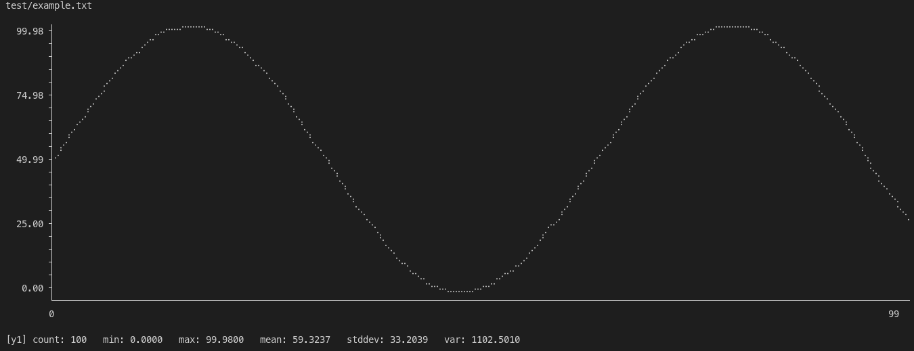
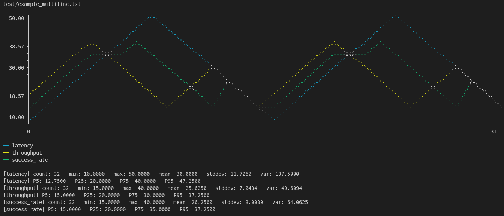
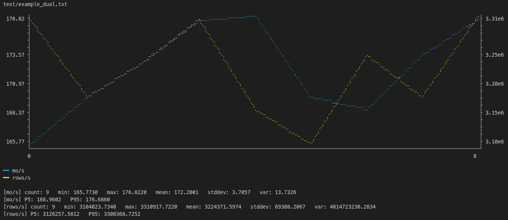
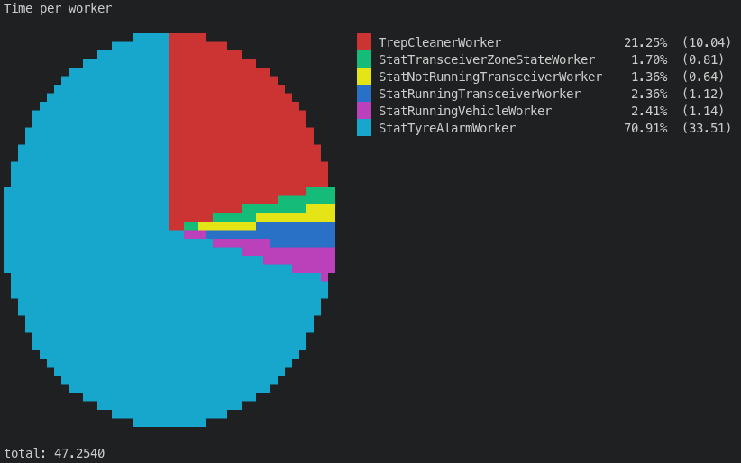

# RS-TERMETER

ASCII graph renderer with statistics

## Usage

Usage: rs-termeter [OPTIONS] [FILE]

Arguments:
  [FILE]  Input file (one number per line). Use "-" or omit for stdin [default: -]

Options:

```
  -t, --title <TITLE>              Title displayed above the graph [default: ""]
  -p, --percentiles <PERCENTILES>  Percentiles to display, comma-separated (e.g. "5,25,50,75,95")
  -n, --names <NAMES>              Names for data columns, comma-separated (e.g. "latency,throughput,errors") Defaults to y1, y2, y3, ... for unnamed columns
  -d, --dual                       Dual Y-axis mode: y1 scale on the left, y2 scale on the right (requires exactly 2 series)
  -P, --pie                        Pie chart mode. Input file format: one "label value" per line. Each slice is rendered with a percentage of the total
  -h, --help                       Print help
```

## Example

### Basic

> see ./test/example.txt
>
> run just example



### Multiple series

> see ./test/example_multiline.txt
>
> run just example-multiline



### Dual

> see ./test/example_dual.txt
>
> run just example-dual



### Pie

> see ./test/example_pie.txt
>
> run just example-pie


